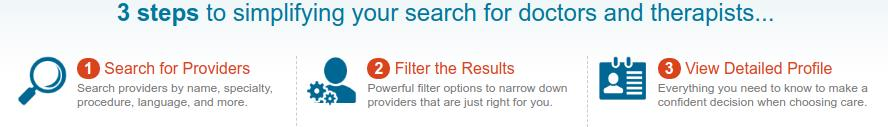
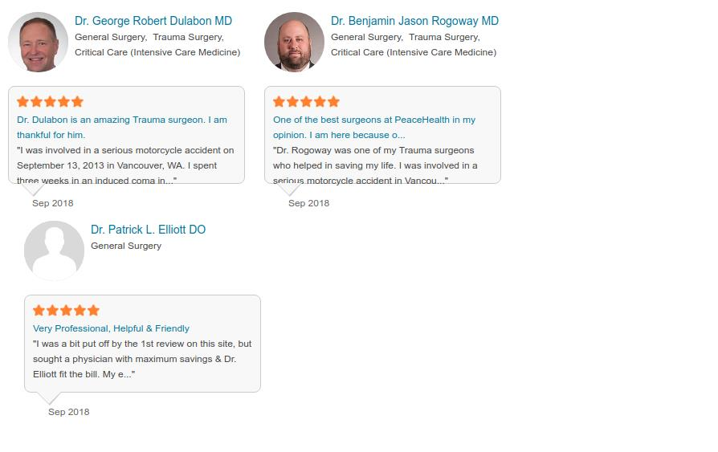

New homepage for docspot.com
===============================

## Project Summary:
The goal of this project is to give docspot.com a new look and feel, improve its user experience, fix the responsive issue, presents docspot's search feature clearly and nicely. 

## DocSpot home page redesign questionnaire
### 24th September 2018

**What is good about the existing page or working well?**

1. The footer is the best part on the page.
2. Content stays in the center of the page which is easy to follow

**What areas need improvement or not working well (feel free to include screenshot)? Why they don’t work well?**
1. 
Very busy, too much text, not sure how helpful it is for user (expecial first time user). The gradient background is not modern, seems old.
2. Doesn’t work well with the header, looks like a white bar that randomly “pasted” there.
3.	 Too much text, not 100% responsive 
4.	 This line of text doesn’t feel part of the page
5.	 The reviews for doctors section is too busy, too much text. Not 100% responsive. The arrow pointing the date which doesn’t make sense. The doctor’s title seems too long. Feel like the person with avatar left the review.
6.	 The layout doesn’t seem right.
7.	 The tagline is small. Not sure how helpful is it for users.

**What make DocSpot unique on the market?**
1.	DocSpot empowers users to search across many different sources. Not only have we indexed many hospital directories, we have also worked on integrating government data.

**Is there an existing branding guidelines (e.g. fonts, colour schemes etc)?**
1.	Not too many restrictions; keep in mind that people generally consider searching for medical professionals to be a serious endeavor.

**What elements (starts from the most important) must show or highlight on this page?**
1.	Must include "Leave a review"
2.	You can type anything in the search bar, include long sentence
3.	The page must have a “leave a review for doctor” section

**Is there any existing element should be removed from this page? If so, please list them (please include screenshot):**

no

**Is there anything new need to be added on this page? If so, please list them:**

no

**What are some similar sites that you like? What do you like about them?**

can't think of any at this moment

**Is there anything to avoid (e.g. never use the Nazi symbol…)?**
1.	Offensive symbols 

**Do you have color preferences, look and feel preferences?**
1.	Color that represents healthcare

